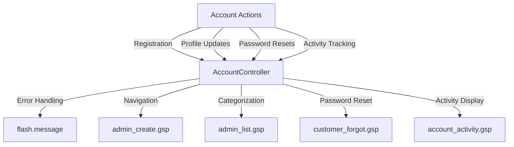

Accounts refer to the user profiles within the application, encapsulating user-specific data and preferences.

Each account contains essential information such as username, email, password, and personal details like name and address.

Accounts also track user activities, including product views, catalog views, page views, and search queries.

The <SwmToken path="grails-app/controllers/greenfield/AccountController.groovy" pos="44:2:2" line-data="class AccountController {">`AccountController`</SwmToken> manages various account-related actions, such as registration, profile updates, password resets, and activity tracking.

The <SwmPath>[grails-app/views/account/account_activity.gsp](grails-app/views/account/account_activity.gsp)</SwmPath> view displays detailed statistics of user activities, including products viewed, catalogs viewed, pages viewed, and searches performed.

Accounts can have different roles, such as customer or admin, which determine the level of access and permissions within the application.

The <SwmToken path="grails-app/views/account/admin_create.gsp" pos="20:9:9" line-data="				&lt;g:link controller=&quot;account&quot; action=&quot;admin_list&quot; params=&quot;[admin:false]&quot;class=&quot;btn btn-default pull-right&quot;&gt;Back to Accounts&lt;/g:link&gt;">`account`</SwmToken> domain class defines the structure and constraints of the account entity, including relationships with other entities like permissions and transactions.

<SwmSnippet path="/grails-app/controllers/greenfield/AccountController.groovy" line="601">

---

## Managing Accounts

The <SwmToken path="grails-app/controllers/greenfield/AccountController.groovy" pos="44:2:2" line-data="class AccountController {">`AccountController`</SwmToken> manages various account-related actions, such as registration, profile updates, password resets, and activity tracking. For example, it handles errors during registration and provides feedback to the user.

```groovy
						flash.message = "There was a problem with your registration, please try again or contact the support. Username may be in use."
```

---

</SwmSnippet>

<SwmSnippet path="/grails-app/views/account/admin_create.gsp" line="20">

---

## Account Views

The <SwmPath>[grails-app/views/account/admin_create.gsp](grails-app/views/account/admin_create.gsp)</SwmPath> view provides a link to navigate back to the list of accounts, facilitating easy navigation for administrators.

```groovy server pages
				<g:link controller="account" action="admin_list" params="[admin:false]"class="btn btn-default pull-right">Back to Accounts</g:link>
```

---

</SwmSnippet>

<SwmSnippet path="/grails-app/views/account/admin_list.gsp" line="15">

---

The <SwmPath>[grails-app/views/account/admin_list.gsp](grails-app/views/account/admin_list.gsp)</SwmPath> view categorizes accounts into Admin and Customer accounts, displaying relevant information and providing navigation options.

```groovy server pages
		<title>Greenfield : Accounts</title>

		<style type="text/css">
			#newsletter-signups-link{
				text-align:right;
			}
		</style>
	</head>
	<body>

		<div id="list-account" class="content scaffold-list" role="main">
		

			<g:if test="${admin}">
				<h2 class="pull-left">Admin Accounts</h2>
			</g:if>
			<g:else>
				<h2 class="pull-left">Customer Accounts</h2>
			</g:else>
			

```

---

</SwmSnippet>

<SwmSnippet path="/grails-app/views/account/customer_forgot.gsp" line="47">

---

The <SwmPath>[grails-app/views/account/customer_forgot.gsp](grails-app/views/account/customer_forgot.gsp)</SwmPath> view handles the process of sending reset password emails, guiding users through the password reset process.

```groovy server pages
			<span class="small">An email will be sent to this address with instructions on how to continue reset process</span>
			<input type="email" value="" id="email" name="email" class="form-control" style="width:250px;"/>
		</div>
		
		<div class="form-group inactive">
			<em>Step Two : Verify Email</em><br/>
			<span class="small">An email will be sent to this address with instructions on how to continue reset process</span>
```

---

</SwmSnippet>

<SwmSnippet path="/grails-app/views/account/account_activity.gsp" line="34">

---

The <SwmPath>[grails-app/views/account/account_activity.gsp](grails-app/views/account/account_activity.gsp)</SwmPath> view displays detailed statistics of user activities, including products viewed, catalogs viewed, pages viewed, and searches performed.

```groovy server pages
			<g:link controller="account" action="admin_list" class="btn btn-default pull-right" name="Back to Accounts">Back to Accounts</g:link>
```

---

</SwmSnippet>



# Account APIs

Account APIs

<SwmSnippet path="/grails-app/views/account/admin_list.gsp" line="2">

---

## <SwmToken path="grails-app/views/account/admin_create.gsp" pos="20:15:15" line-data="				&lt;g:link controller=&quot;account&quot; action=&quot;admin_list&quot; params=&quot;[admin:false]&quot;class=&quot;btn btn-default pull-right&quot;&gt;Back to Accounts&lt;/g:link&gt;">`admin_list`</SwmToken>

The <SwmToken path="grails-app/views/account/admin_create.gsp" pos="20:15:15" line-data="				&lt;g:link controller=&quot;account&quot; action=&quot;admin_list&quot; params=&quot;[admin:false]&quot;class=&quot;btn btn-default pull-right&quot;&gt;Back to Accounts&lt;/g:link&gt;">`admin_list`</SwmToken> endpoint is used to display a list of accounts. It includes functionality for searching accounts by name, username, or email, and differentiates between admin and customer accounts. The view also provides options to create new accounts and paginate through the list of accounts.

```groovy server pages
<%@ 
page import="org.greenfield.Account" 
page import="org.greenfield.log.CatalogViewLog"
page import="org.greenfield.log.ProductViewLog"
page import="org.greenfield.log.PageViewLog"
page import="org.greenfield.log.SearchLog"
page import="org.greenfield.Transaction"
%>
<!DOCTYPE html>
<html>
	<head>
		<meta name="layout" content="admin">
		<g:set var="entityName" value="${message(code: 'account.label', default: 'Account')}" />
		<title>Greenfield : Accounts</title>

		<style type="text/css">
			#newsletter-signups-link{
				text-align:right;
			}
		</style>
	</head>
```

---

</SwmSnippet>

<SwmSnippet path="/grails-app/views/account/admin_edit.gsp" line="1">

---

## <SwmToken path="grails-app/controllers/greenfield/AccountController.groovy" pos="707:3:3" line-data="	def admin_edit(Long id){">`admin_edit`</SwmToken>

The <SwmToken path="grails-app/controllers/greenfield/AccountController.groovy" pos="707:3:3" line-data="	def admin_edit(Long id){">`admin_edit`</SwmToken> endpoint is used to edit account details. It displays a form with fields for username, email, name, address, city, state, zip, and phone. The form also includes a checkbox to indicate if the account has admin privileges. The view handles form submission for updating the account information.

```groovy server pages
<%@ page import="org.greenfield.Account" %>
<%@ page import="org.greenfield.common.RoleName" %>
<%@ page import="org.greenfield.State" %>
<% def applicationService = grailsApplication.classLoader.loadClass('org.greenfield.ApplicationService').newInstance()%>


<!DOCTYPE html>
<html>
	<head>
		<meta name="layout" content="admin">
		<g:set var="entityName" value="${message(code: 'account.label', default: 'Account')}" />
		<title>Edit Account</title>

	</head>
	<body>


	<div class="form-outer-container">
	
	
		<div class="form-container">
```

---

</SwmSnippet>

&nbsp;

*This is an auto-generated document by Swimm AI 🌊 and has not yet been verified by a human*

<SwmMeta version="3.0.0" repo-id="Z2l0aHViJTNBJTNBZ3JlZW5maWVsZC1lY29tbWVyY2UlM0ElM0FTd2ltbS1EZW1v" repo-name="greenfield-ecommerce" doc-type="overview"><sup>Powered by [Swimm](/)</sup></SwmMeta>
