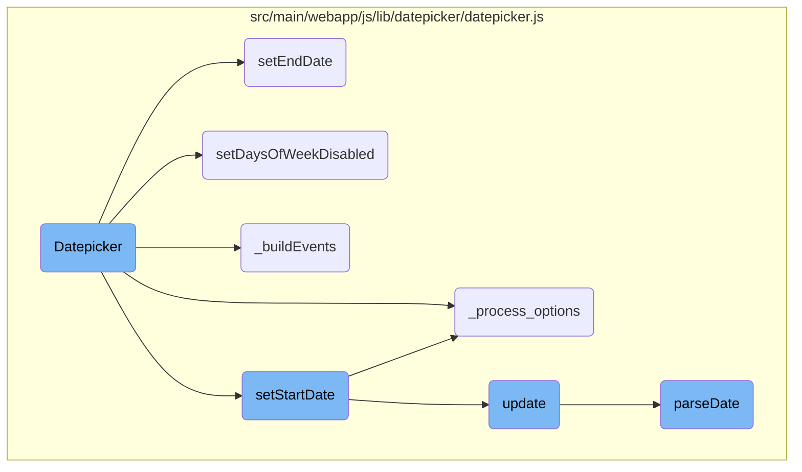
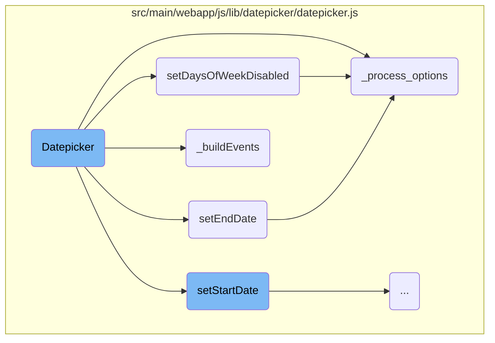
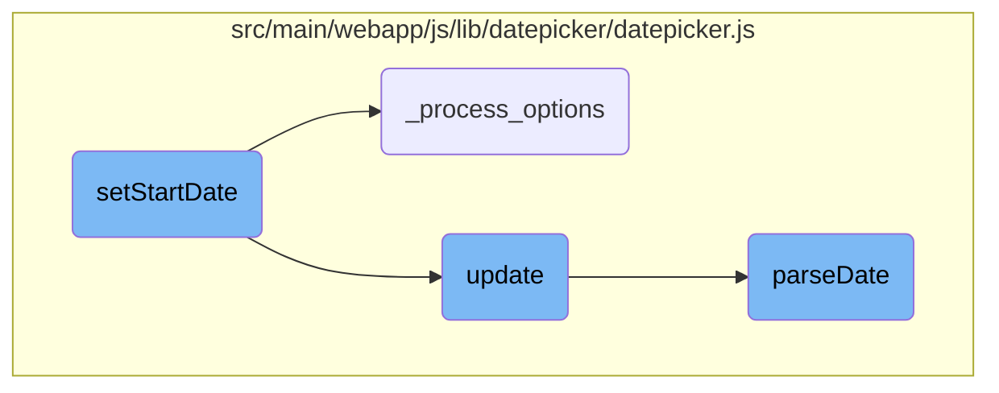

In this document, we will explain the Datepicker component. The Datepicker is a user interface element that allows users to select dates from a calendar view. It is initialized with specific options, attaches event listeners, and updates its state based on user interactions and provided options.

The Datepicker component starts by initializing with given options and setting up its initial state. It then attaches event listeners to handle user interactions like selecting dates. Users can set start and end dates, disable specific days of the week, and the Datepicker will update its display accordingly. The component processes options to ensure they are correctly formatted and sets default values where necessary. When dates are selected or changed, the Datepicker updates its state and triggers relevant events to reflect these changes.

Here is a high level diagram of the flow, showing only the most important functions:



# Flow drill down

First, we'll zoom into this section of the flow:



<SwmSnippet path="/src/main/webapp/js/lib/datepicker/datepicker.js" line="86">

---

## Datepicker Initialization

The <SwmToken path="src/main/webapp/js/lib/datepicker/datepicker.js" pos="86:3:3" line-data="	var Datepicker = function(element, options){">`Datepicker`</SwmToken> function initializes the date picker component. It sets up the initial state, processes options, attaches events, and configures the display properties of the date picker.

```javascript
	var Datepicker = function(element, options){
		this.dates = new DateArray();
		this.viewDate = UTCToday();
		this.focusDate = null;

		this._process_options(options);

		this.element = $(element);
		this.isInline = false;
		this.isInput = this.element.is('input');
		this.component = this.element.is('.date') ? this.element.find('.add-on, .input-group-addon, .btn') : false;
		this.hasInput = this.component && this.element.find('input').length;
		if (this.component && this.component.length === 0)
			this.component = false;

		this.picker = $(DPGlobal.template);
		this._buildEvents();
		this._attachEvents();

		if (this.isInline){
			this.picker.addClass('datepicker-inline').appendTo(this.element);
```

---

</SwmSnippet>

<SwmSnippet path="/src/main/webapp/js/lib/datepicker/datepicker.js" line="528">

---

## Setting End Date

The <SwmToken path="src/main/webapp/js/lib/datepicker/datepicker.js" pos="528:1:1" line-data="		setEndDate: function(endDate){">`setEndDate`</SwmToken> function updates the end date of the date picker. It processes the new end date option and triggers an update to refresh the date picker display.

```javascript
		setEndDate: function(endDate){
			this._process_options({endDate: endDate});
			this.update();
			this.updateNavArrows();
		},
```

---

</SwmSnippet>

<SwmSnippet path="/src/main/webapp/js/lib/datepicker/datepicker.js" line="534">

---

## Disabling Days of the Week

The <SwmToken path="src/main/webapp/js/lib/datepicker/datepicker.js" pos="534:1:1" line-data="		setDaysOfWeekDisabled: function(daysOfWeekDisabled){">`setDaysOfWeekDisabled`</SwmToken> function disables specific days of the week in the date picker. It processes the days to be disabled and updates the date picker accordingly.

```javascript
		setDaysOfWeekDisabled: function(daysOfWeekDisabled){
			this._process_options({daysOfWeekDisabled: daysOfWeekDisabled});
			this.update();
			this.updateNavArrows();
		},
```

---

</SwmSnippet>

<SwmSnippet path="/src/main/webapp/js/lib/datepicker/datepicker.js" line="296">

---

## Building Events

The <SwmToken path="src/main/webapp/js/lib/datepicker/datepicker.js" pos="296:1:1" line-data="		_buildEvents: function(){">`_buildEvents`</SwmToken> function sets up event listeners for the date picker. It handles different scenarios such as single input, component input with button, and inline date picker, and attaches the necessary event handlers.

```javascript
		_buildEvents: function(){
			if (this.isInput){ // single input
				this._events = [
					[this.element, {
						focus: $.proxy(this.show, this),
						keyup: $.proxy(function(e){
							if ($.inArray(e.keyCode, [27,37,39,38,40,32,13,9]) === -1)
								this.update();
						}, this),
						keydown: $.proxy(this.keydown, this)
					}]
				];
			}
			else if (this.component && this.hasInput){ // component: input + button
				this._events = [
					// For components that are not readonly, allow keyboard nav
					[this.element.find('input'), {
						focus: $.proxy(this.show, this),
						keyup: $.proxy(function(e){
							if ($.inArray(e.keyCode, [27,37,39,38,40,32,13,9]) === -1)
								this.update();
```

---

</SwmSnippet>

<SwmSnippet path="/src/main/webapp/js/lib/datepicker/datepicker.js" line="146">

---

## Processing Options

The <SwmToken path="src/main/webapp/js/lib/datepicker/datepicker.js" pos="146:1:1" line-data="		_process_options: function(opts){">`_process_options`</SwmToken> function processes and validates the options provided to the date picker. It ensures that the options are correctly formatted and sets default values where necessary.

```javascript
		_process_options: function(opts){
			// Store raw options for reference
			this._o = $.extend({}, this._o, opts);
			// Processed options
			var o = this.o = $.extend({}, this._o);

			// Check if "de-DE" style date is available, if not language should
			// fallback to 2 letter code eg "de"
			var lang = o.language;
			if (!dates[lang]){
				lang = lang.split('-')[0];
				if (!dates[lang])
					lang = defaults.language;
			}
			o.language = lang;

			switch (o.startView){
				case 2:
				case 'decade':
					o.startView = 2;
					break;
```

---

</SwmSnippet>

Now, lets zoom into this section of the flow:



<SwmSnippet path="/src/main/webapp/js/lib/datepicker/datepicker.js" line="522">

---

## Setting the Start Date

The <SwmToken path="src/main/webapp/js/lib/datepicker/datepicker.js" pos="522:1:1" line-data="		setStartDate: function(startDate){">`setStartDate`</SwmToken> function is responsible for initializing the start date of the datepicker. It calls <SwmToken path="src/main/webapp/js/lib/datepicker/datepicker.js" pos="523:3:3" line-data="			this._process_options({startDate: startDate});">`_process_options`</SwmToken> to process the provided start date and then triggers the <SwmToken path="src/main/webapp/js/lib/datepicker/datepicker.js" pos="524:3:3" line-data="			this.update();">`update`</SwmToken> function to refresh the datepicker with the new settings.

```javascript
		setStartDate: function(startDate){
			this._process_options({startDate: startDate});
			this.update();
			this.updateNavArrows();
		},
```

---

</SwmSnippet>

<SwmSnippet path="/src/main/webapp/js/lib/datepicker/datepicker.js" line="609">

---

## Updating the Datepicker

The <SwmToken path="src/main/webapp/js/lib/datepicker/datepicker.js" pos="609:1:1" line-data="		update: function(){">`update`</SwmToken> function refreshes the datepicker's state based on the current dates. It handles both input from arguments and data attributes, parses the dates, and updates the view accordingly. It also triggers events like <SwmToken path="src/main/webapp/js/lib/datepicker/datepicker.js" pos="486:6:6" line-data="			this._trigger(&#39;changeDate&#39;);">`changeDate`</SwmToken> and <SwmToken path="src/main/webapp/js/lib/datepicker/datepicker.js" pos="664:6:6" line-data="				this._trigger(&#39;clearDate&#39;);">`clearDate`</SwmToken> based on the changes.

```javascript
		update: function(){
			if (!this._allow_update)
				return;

			var oldDates = this.dates.copy(),
				dates = [],
				fromArgs = false;
			if (arguments.length){
				$.each(arguments, $.proxy(function(i, date){
					if (date instanceof Date)
						date = this._local_to_utc(date);
					dates.push(date);
				}, this));
				fromArgs = true;
			}
			else {
				dates = this.isInput
						? this.element.val()
						: this.element.data('date') || this.element.find('input').val();
				if (dates && this.o.multidate)
					dates = dates.split(this.o.multidateSeparator);
```

---

</SwmSnippet>

<SwmSnippet path="/src/main/webapp/js/lib/datepicker/datepicker.js" line="1476">

---

### Parsing Dates

The <SwmToken path="src/main/webapp/js/lib/datepicker/datepicker.js" pos="1476:1:1" line-data="		parseDate: function(date, format, language){">`parseDate`</SwmToken> function is used within the <SwmToken path="src/main/webapp/js/lib/datepicker/datepicker.js" pos="303:3:3" line-data="								this.update();">`update`</SwmToken> function to convert date strings into JavaScript <SwmToken path="src/main/webapp/js/lib/datepicker/datepicker.js" pos="1476:6:6" line-data="		parseDate: function(date, format, language){">`date`</SwmToken> objects. It handles various date formats and languages, ensuring that the datepicker can interpret and display dates correctly.

```javascript
		parseDate: function(date, format, language){
			if (!date)
				return undefined;
			if (date instanceof Date)
				return date;
			if (typeof format === 'string')
				format = DPGlobal.parseFormat(format);
			var part_re = /([\-+]\d+)([dmwy])/,
				parts = date.match(/([\-+]\d+)([dmwy])/g),
				part, dir, i;
			if (/^[\-+]\d+[dmwy]([\s,]+[\-+]\d+[dmwy])*$/.test(date)){
				date = new Date();
				for (i=0; i < parts.length; i++){
					part = part_re.exec(parts[i]);
					dir = parseInt(part[1]);
					switch (part[2]){
						case 'd':
							date.setUTCDate(date.getUTCDate() + dir);
							break;
						case 'm':
							date = Datepicker.prototype.moveMonth.call(Datepicker.prototype, date, dir);
```

---

</SwmSnippet>

&nbsp;

*This is an auto-generated document by Swimm AI 🌊 and has not yet been verified by a human*

<SwmMeta version="3.0.0" repo-id="Z2l0aHViJTNBJTNBZ3JlZW5maWVsZC1lY29tbWVyY2UlM0ElM0FTd2ltbS1EZW1v" repo-name="greenfield-ecommerce" doc-type="flows"><sup>Powered by [Swimm](/)</sup></SwmMeta>
