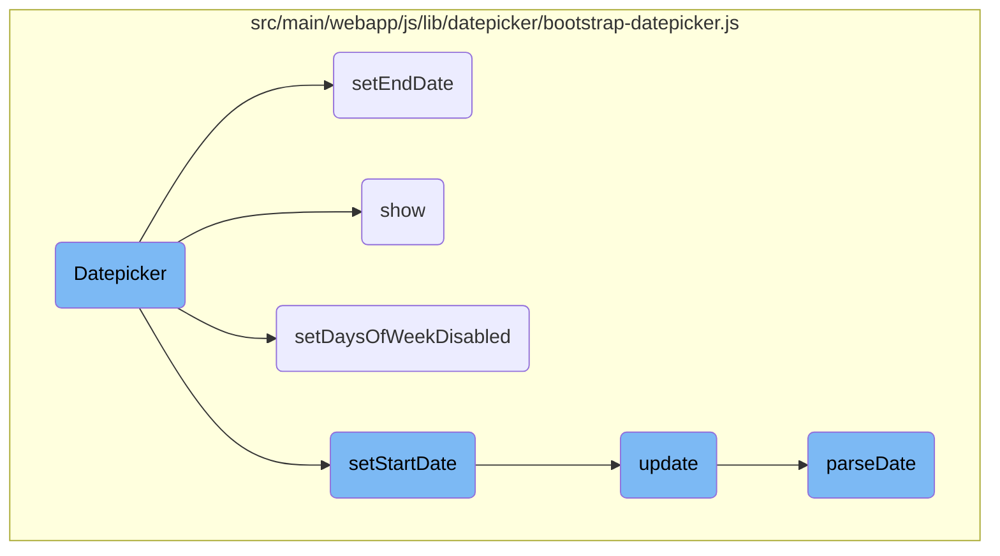

In this document, we will explain the process of initializing and using a datepicker component. The process involves setting up the datepicker, configuring its options, and handling various functionalities such as setting start and end dates, showing the datepicker, and disabling specific days of the week.

The flow is straightforward and involves several steps: initializing the datepicker with specific options, setting the start and end dates, showing the datepicker, and disabling certain days of the week. Each step ensures that the datepicker functions correctly and provides a user-friendly interface for selecting dates.

# Flow drill down



<SwmSnippet path="/src/main/webapp/js/lib/datepicker/bootstrap-datepicker.js" line="33">

---

## Datepicker Initialization

The <SwmToken path="src/main/webapp/js/lib/datepicker/bootstrap-datepicker.js" pos="33:3:3" line-data="	var Datepicker = function(element, options) {">`Datepicker`</SwmToken> function initializes the datepicker component. It sets up various properties such as <SwmToken path="src/main/webapp/js/lib/datepicker/bootstrap-datepicker.js" pos="33:9:9" line-data="	var Datepicker = function(element, options) {">`element`</SwmToken>, <SwmToken path="src/main/webapp/js/lib/datepicker/bootstrap-datepicker.js" pos="37:3:3" line-data="		this.language = options.language||this.element.data(&#39;date-language&#39;)||&quot;en&quot;;">`language`</SwmToken>, <SwmToken path="src/main/webapp/js/lib/datepicker/bootstrap-datepicker.js" pos="40:3:3" line-data="		this.format = DPGlobal.parseFormat(options.format||this.element.data(&#39;date-format&#39;)||&#39;mm/dd/yyyy&#39;);">`format`</SwmToken>, and attaches events. It also configures options like <SwmToken path="src/main/webapp/js/lib/datepicker/bootstrap-datepicker.js" pos="82:3:3" line-data="		this.autoclose = false;">`autoclose`</SwmToken>, <SwmToken path="src/main/webapp/js/lib/datepicker/bootstrap-datepicker.js" pos="89:3:3" line-data="		this.keyboardNavigation = true;">`keyboardNavigation`</SwmToken>, and view modes. The datepicker is appended to the DOM and styled based on whether it is inline or a dropdown.

```javascript
	var Datepicker = function(element, options) {
		var that = this;

		this.element = $(element);
		this.language = options.language||this.element.data('date-language')||"en";
		this.language = this.language in dates ? this.language : "en";
		this.isRTL = dates[this.language].rtl||false;
		this.format = DPGlobal.parseFormat(options.format||this.element.data('date-format')||'mm/dd/yyyy');
		this.isInline = false;
		this.isInput = this.element.is('input');
		this.component = this.element.is('.date') ? this.element.find('.add-on') : false;
		this.hasInput = this.component && this.element.find('input').length;
		if(this.component && this.component.length === 0)
			this.component = false;

		this._attachEvents();

		this.forceParse = true;
		if ('forceParse' in options) {
			this.forceParse = options.forceParse;
		} else if ('dateForceParse' in this.element.data()) {
```

---

</SwmSnippet>

<SwmSnippet path="/src/main/webapp/js/lib/datepicker/bootstrap-datepicker.js" line="273">

---

## Setting End Date

The <SwmToken path="src/main/webapp/js/lib/datepicker/bootstrap-datepicker.js" pos="273:1:1" line-data="		setEndDate: function(endDate){">`setEndDate`</SwmToken> function sets the end date for the datepicker. If an end date is provided, it is parsed and set; otherwise, it defaults to <SwmToken path="src/main/webapp/js/lib/datepicker/bootstrap-datepicker.js" pos="274:9:9" line-data="			this.endDate = endDate||Infinity;">`Infinity`</SwmToken>. The function then calls <SwmToken path="src/main/webapp/js/lib/datepicker/bootstrap-datepicker.js" pos="278:3:3" line-data="			this.update();">`update`</SwmToken> to refresh the datepicker and <SwmToken path="src/main/webapp/js/lib/datepicker/bootstrap-datepicker.js" pos="279:3:3" line-data="			this.updateNavArrows();">`updateNavArrows`</SwmToken> to adjust navigation arrows.

```javascript
		setEndDate: function(endDate){
			this.endDate = endDate||Infinity;
			if (this.endDate !== Infinity) {
				this.endDate = DPGlobal.parseDate(this.endDate, this.format, this.language);
			}
			this.update();
			this.updateNavArrows();
		},
```

---

</SwmSnippet>

<SwmSnippet path="/src/main/webapp/js/lib/datepicker/bootstrap-datepicker.js" line="182">

---

## Showing the Datepicker

The <SwmToken path="src/main/webapp/js/lib/datepicker/bootstrap-datepicker.js" pos="182:1:1" line-data="		show: function(e) {">`show`</SwmToken> function displays the datepicker. It calculates the height of the component, updates the datepicker, and positions it correctly. It also binds a resize event to reposition the datepicker if the window size changes. Finally, it triggers a <SwmToken path="src/main/webapp/js/lib/datepicker/bootstrap-datepicker.js" pos="182:1:1" line-data="		show: function(e) {">`show`</SwmToken> event.

```javascript
		show: function(e) {
			this.picker.show();
			this.height = this.component ? this.component.outerHeight() : this.element.outerHeight();
			this.update();
			this.place();
			$(window).on('resize', $.proxy(this.place, this));
			if (e ) {
				e.stopPropagation();
				e.preventDefault();
			}
			this.element.trigger({
				type: 'show',
				date: this.date
			});
		},
```

---

</SwmSnippet>

<SwmSnippet path="/src/main/webapp/js/lib/datepicker/bootstrap-datepicker.js" line="282">

---

## Disabling Days of the Week

The <SwmToken path="src/main/webapp/js/lib/datepicker/bootstrap-datepicker.js" pos="282:1:1" line-data="		setDaysOfWeekDisabled: function(daysOfWeekDisabled){">`setDaysOfWeekDisabled`</SwmToken> function disables specific days of the week. It accepts an array or a comma-separated string of days to disable. The days are parsed and converted to integers, and the datepicker is updated accordingly.

```javascript
		setDaysOfWeekDisabled: function(daysOfWeekDisabled){
			this.daysOfWeekDisabled = daysOfWeekDisabled||[];
			if (!$.isArray(this.daysOfWeekDisabled)) {
				this.daysOfWeekDisabled = this.daysOfWeekDisabled.split(/,\s*/);
			}
			this.daysOfWeekDisabled = $.map(this.daysOfWeekDisabled, function (d) {
				return parseInt(d, 10);
			});
			this.update();
			this.updateNavArrows();
		},
```

---

</SwmSnippet>

<SwmSnippet path="/src/main/webapp/js/lib/datepicker/bootstrap-datepicker.js" line="264">

---

## Setting Start Date

The <SwmToken path="src/main/webapp/js/lib/datepicker/bootstrap-datepicker.js" pos="264:1:1" line-data="		setStartDate: function(startDate){">`setStartDate`</SwmToken> function sets the start date for the datepicker. If a start date is provided, it is parsed and set; otherwise, it defaults to <SwmToken path="src/main/webapp/js/lib/datepicker/bootstrap-datepicker.js" pos="266:10:11" line-data="			if (this.startDate !== -Infinity) {">`-Infinity`</SwmToken>. The function then calls <SwmToken path="src/main/webapp/js/lib/datepicker/bootstrap-datepicker.js" pos="269:3:3" line-data="			this.update();">`update`</SwmToken> to refresh the datepicker and <SwmToken path="src/main/webapp/js/lib/datepicker/bootstrap-datepicker.js" pos="270:3:3" line-data="			this.updateNavArrows();">`updateNavArrows`</SwmToken> to adjust navigation arrows.

```javascript
		setStartDate: function(startDate){
			this.startDate = startDate||-Infinity;
			if (this.startDate !== -Infinity) {
				this.startDate = DPGlobal.parseDate(this.startDate, this.format, this.language);
			}
			this.update();
			this.updateNavArrows();
		},
```

---

</SwmSnippet>

<SwmSnippet path="/src/main/webapp/js/lib/datepicker/bootstrap-datepicker.js" line="308">

---

## Updating the Datepicker

The <SwmToken path="src/main/webapp/js/lib/datepicker/bootstrap-datepicker.js" pos="308:1:1" line-data="		update: function(){">`update`</SwmToken> function refreshes the datepicker based on the current date. It parses the date from the input or data attribute, sets the view date, and triggers a <SwmToken path="src/main/webapp/js/lib/datepicker/bootstrap-datepicker.js" pos="332:5:5" line-data="					type: &#39;changeDate&#39;,">`changeDate`</SwmToken> event if the view date changes. The function then calls <SwmToken path="src/main/webapp/js/lib/datepicker/bootstrap-datepicker.js" pos="336:3:3" line-data="			this.fill();">`fill`</SwmToken> to update the datepicker UI.

```javascript
		update: function(){
			var date, fromArgs = false;
			if(arguments && arguments.length && (typeof arguments[0] === 'string' || arguments[0] instanceof Date)) {
				date = arguments[0];
				fromArgs = true;
			} else {
				date = this.isInput ? this.element.val() : this.element.data('date') || this.element.find('input').val();
			}

			this.date = DPGlobal.parseDate(date, this.format, this.language);

			if(fromArgs) this.setValue();

			var oldViewDate = this.viewDate;
			if (this.date < this.startDate) {
				this.viewDate = new Date(this.startDate);
			} else if (this.date > this.endDate) {
				this.viewDate = new Date(this.endDate);
			} else {
				this.viewDate = new Date(this.date);
			}
```

---

</SwmSnippet>

<SwmSnippet path="/src/main/webapp/js/lib/datepicker/bootstrap-datepicker.js" line="813">

---

## Parsing Dates

The <SwmToken path="src/main/webapp/js/lib/datepicker/bootstrap-datepicker.js" pos="813:1:1" line-data="		parseDate: function(date, format, language) {">`parseDate`</SwmToken> function converts a date string into a <SwmToken path="src/main/webapp/js/lib/datepicker/bootstrap-datepicker.js" pos="813:6:6" line-data="		parseDate: function(date, format, language) {">`date`</SwmToken> object. It supports various date formats and relative date strings (e.g., '+1d' for one day in the future). The function uses a map of setters to update the <SwmToken path="src/main/webapp/js/lib/datepicker/bootstrap-datepicker.js" pos="813:6:6" line-data="		parseDate: function(date, format, language) {">`date`</SwmToken> object based on the parsed values.

```javascript
		parseDate: function(date, format, language) {
			if (date instanceof Date) return date;
			if (/^[\-+]\d+[dmwy]([\s,]+[\-+]\d+[dmwy])*$/.test(date)) {
				var part_re = /([\-+]\d+)([dmwy])/,
					parts = date.match(/([\-+]\d+)([dmwy])/g),
					part, dir;
				date = new Date();
				for (var i=0; i<parts.length; i++) {
					part = part_re.exec(parts[i]);
					dir = parseInt(part[1]);
					switch(part[2]){
						case 'd':
							date.setUTCDate(date.getUTCDate() + dir);
							break;
						case 'm':
							date = Datepicker.prototype.moveMonth.call(Datepicker.prototype, date, dir);
							break;
						case 'w':
							date.setUTCDate(date.getUTCDate() + dir * 7);
							break;
						case 'y':
```

---

</SwmSnippet>

&nbsp;

*This is an auto-generated document by Swimm AI 🌊 and has not yet been verified by a human*

<SwmMeta version="3.0.0" repo-id="Z2l0aHViJTNBJTNBZ3JlZW5maWVsZC1lY29tbWVyY2UlM0ElM0FTd2ltbS1EZW1v" repo-name="greenfield-ecommerce" doc-type="flows"><sup>Powered by [Swimm](/)</sup></SwmMeta>
