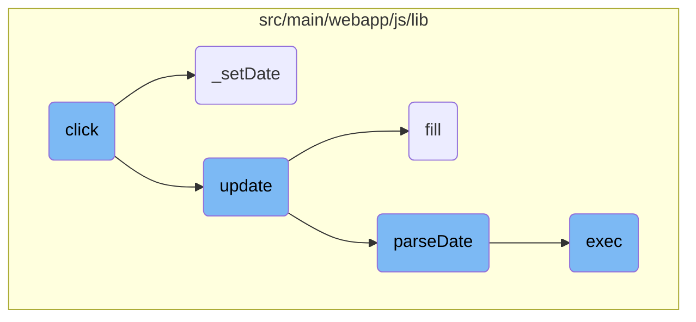
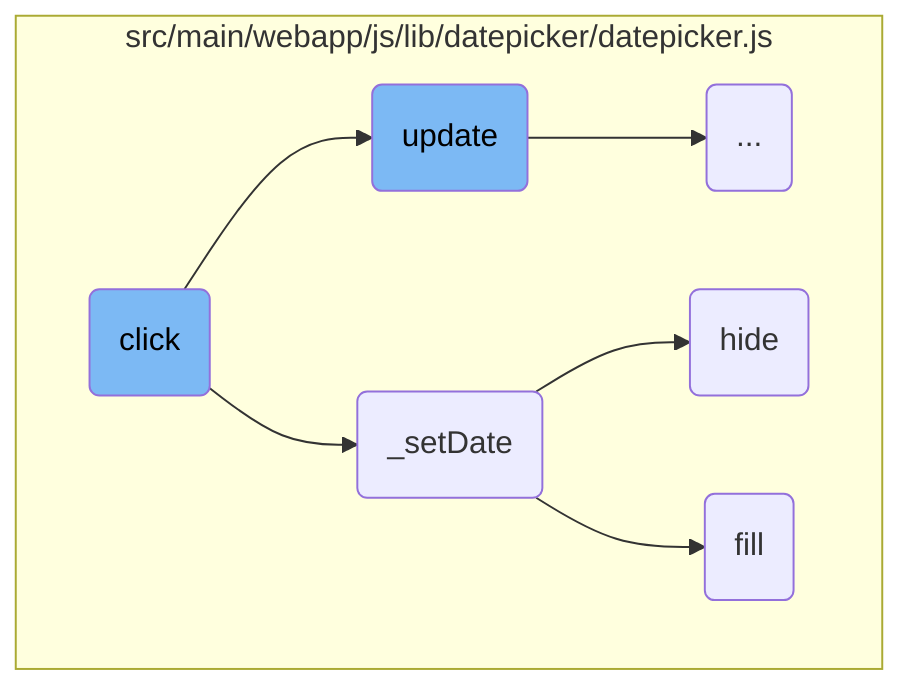
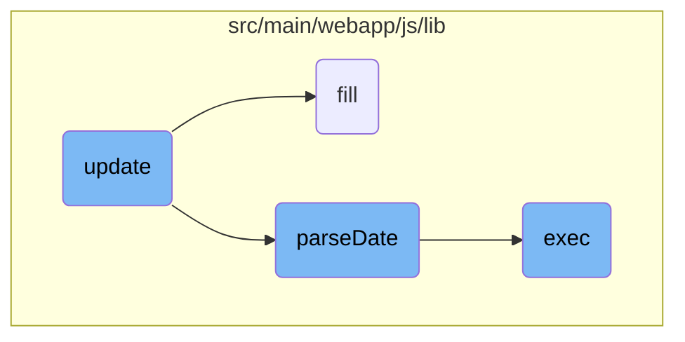

This document provides an overview of how the <SwmToken path="src/main/webapp/js/lib/datepicker/datepicker.js" pos="908:1:1" line-data="		click: function(e){">`click`</SwmToken> function operates within the datepicker component. It explains how user interactions are handled, how the datepicker's state is updated, and how different actions are performed based on the user's input.

When a user clicks on the datepicker, the <SwmToken path="src/main/webapp/js/lib/datepicker/datepicker.js" pos="908:1:1" line-data="		click: function(e){">`click`</SwmToken> function is triggered. This function first prevents any default actions that might occur. It then identifies the element that was clicked and determines what action to take based on the type and class of that element. For example, if the user clicks on a navigation button, the datepicker will move to the next or previous month. If the user selects a date, the datepicker will update its state to reflect the new date. This ensures that the datepicker responds correctly to user inputs and keeps its display up-to-date.

Here is a high level diagram of the flow, showing only the most important functions:



# Flow drill down

First, we'll zoom into this section of the flow:



<SwmSnippet path="/src/main/webapp/js/lib/datepicker/datepicker.js" line="908">

---

## Handling User Clicks

The <SwmToken path="src/main/webapp/js/lib/datepicker/datepicker.js" pos="908:1:1" line-data="		click: function(e){">`click`</SwmToken> function handles various user interactions with the datepicker. It prevents the default action of the event and determines the target element that was clicked. Depending on the target element's type and class, it performs different actions such as changing the view mode, navigating through months or years, setting the date to today, clearing the date, or selecting a specific date. This function ensures that the datepicker responds appropriately to user inputs and updates its state accordingly.

```javascript
		click: function(e){
			e.preventDefault();
			var target = $(e.target).closest('span, td, th'),
				year, month, day;
			if (target.length === 1){
				switch (target[0].nodeName.toLowerCase()){
					case 'th':
						switch (target[0].className){
							case 'datepicker-switch':
								this.showMode(1);
								break;
							case 'prev':
							case 'next':
								var dir = DPGlobal.modes[this.viewMode].navStep * (target[0].className === 'prev' ? -1 : 1);
								switch (this.viewMode){
									case 0:
										this.viewDate = this.moveMonth(this.viewDate, dir);
										this._trigger('changeMonth', this.viewDate);
										break;
									case 1:
									case 2:
```

---

</SwmSnippet>

<SwmSnippet path="/src/main/webapp/js/lib/datepicker/datepicker.js" line="1039">

---

## Setting the Date

The <SwmToken path="src/main/webapp/js/lib/datepicker/datepicker.js" pos="1039:1:1" line-data="		_setDate: function(date, which){">`_setDate`</SwmToken> function is responsible for updating the datepicker's internal state with a new date. It can update both the selected date and the view date, depending on the <SwmToken path="src/main/webapp/js/lib/datepicker/datepicker.js" pos="1039:9:9" line-data="		_setDate: function(date, which){">`which`</SwmToken> parameter. After setting the date, it triggers the <SwmToken path="src/main/webapp/js/lib/datepicker/datepicker.js" pos="1047:6:6" line-data="			this._trigger(&#39;changeDate&#39;);">`changeDate`</SwmToken> event, updates the input element's value, and optionally hides the datepicker if the <SwmToken path="src/main/webapp/js/lib/datepicker/datepicker.js" pos="1058:8:8" line-data="			if (this.o.autoclose &amp;&amp; (!which || which === &#39;date&#39;)){">`autoclose`</SwmToken> option is enabled. This function ensures that the datepicker's state is consistent with the user's selection.

```javascript
		_setDate: function(date, which){
			if (!which || which === 'date')
				this._toggle_multidate(date && new Date(date));
			if (!which || which  === 'view')
				this.viewDate = date && new Date(date);

			this.fill();
			this.setValue();
			this._trigger('changeDate');
			var element;
			if (this.isInput){
				element = this.element;
			}
			else if (this.component){
				element = this.element.find('input');
			}
			if (element){
				element.change();
			}
			if (this.o.autoclose && (!which || which === 'date')){
				this.hide();
```

---

</SwmSnippet>

<SwmSnippet path="/src/main/webapp/js/lib/datepicker/datepicker.js" line="419">

---

## Hiding the Datepicker

The <SwmToken path="src/main/webapp/js/lib/datepicker/datepicker.js" pos="419:1:1" line-data="		hide: function(){">`hide`</SwmToken> function hides the datepicker and detaches it from the DOM. It also resets the view mode to the start view and triggers the <SwmToken path="src/main/webapp/js/lib/datepicker/datepicker.js" pos="419:1:1" line-data="		hide: function(){">`hide`</SwmToken> event. If the <SwmToken path="src/main/webapp/js/lib/datepicker/datepicker.js" pos="431:5:5" line-data="				this.o.forceParse &amp;&amp;">`forceParse`</SwmToken> option is enabled, it ensures that the input element's value is parsed and set correctly. This function is crucial for managing the visibility of the datepicker and ensuring that it is hidden when not in use.

```javascript
		hide: function(){
			if (this.isInline)
				return;
			if (!this.picker.is(':visible'))
				return;
			this.focusDate = null;
			this.picker.hide().detach();
			this._detachSecondaryEvents();
			this.viewMode = this.o.startView;
			this.showMode();

			if (
				this.o.forceParse &&
				(
					this.isInput && this.element.val() ||
					this.hasInput && this.element.find('input').val()
				)
			)
				this.setValue();
			this._trigger('hide');
		},
```

---

</SwmSnippet>

<SwmSnippet path="/src/main/webapp/js/lib/datepicker/datepicker.js" line="740">

---

## Filling the Datepicker

The <SwmToken path="src/main/webapp/js/lib/datepicker/datepicker.js" pos="740:1:1" line-data="		fill: function(){">`fill`</SwmToken> function populates the datepicker with the appropriate dates, months, and years based on the current view date. It updates the header, footer, and body of the datepicker with the correct values and styles. This function ensures that the datepicker displays the correct information and is visually consistent with the selected date and view mode.

```javascript
		fill: function(){
			var d = new Date(this.viewDate),
				year = d.getUTCFullYear(),
				month = d.getUTCMonth(),
				startYear = this.o.startDate !== -Infinity ? this.o.startDate.getUTCFullYear() : -Infinity,
				startMonth = this.o.startDate !== -Infinity ? this.o.startDate.getUTCMonth() : -Infinity,
				endYear = this.o.endDate !== Infinity ? this.o.endDate.getUTCFullYear() : Infinity,
				endMonth = this.o.endDate !== Infinity ? this.o.endDate.getUTCMonth() : Infinity,
				todaytxt = dates[this.o.language].today || dates['en'].today || '',
				cleartxt = dates[this.o.language].clear || dates['en'].clear || '',
				tooltip;
			if (isNaN(year) || isNaN(month)) return;
			this.picker.find('.datepicker-days thead th.datepicker-switch')
						.text(dates[this.o.language].months[month]+' '+year);
			this.picker.find('tfoot th.today')
						.text(todaytxt)
						.toggle(this.o.todayBtn !== false);
			this.picker.find('tfoot th.clear')
						.text(cleartxt)
						.toggle(this.o.clearBtn !== false);
			this.updateNavArrows();
```

---

</SwmSnippet>

Now, lets zoom into this section of the flow:



<SwmSnippet path="/src/main/webapp/js/lib/datepicker/datepicker.js" line="609">

---

## Update Function

The <SwmToken path="src/main/webapp/js/lib/datepicker/datepicker.js" pos="609:1:1" line-data="		update: function(){">`update`</SwmToken> function manages the updating of date values in the datepicker component. It processes both user input and programmatic changes, ensuring the datepicker reflects the correct dates. It handles different input formats, validates the dates, and triggers events based on the changes.

```javascript
		update: function(){
			if (!this._allow_update)
				return;

			var oldDates = this.dates.copy(),
				dates = [],
				fromArgs = false;
			if (arguments.length){
				$.each(arguments, $.proxy(function(i, date){
					if (date instanceof Date)
						date = this._local_to_utc(date);
					dates.push(date);
				}, this));
				fromArgs = true;
			}
			else {
				dates = this.isInput
						? this.element.val()
						: this.element.data('date') || this.element.find('input').val();
				if (dates && this.o.multidate)
					dates = dates.split(this.o.multidateSeparator);
```

---

</SwmSnippet>

<SwmSnippet path="/src/main/webapp/js/lib/datepicker/datepicker.js" line="1476">

---

## <SwmToken path="src/main/webapp/js/lib/datepicker/datepicker.js" pos="1476:1:1" line-data="		parseDate: function(date, format, language){">`parseDate`</SwmToken> Function

The <SwmToken path="src/main/webapp/js/lib/datepicker/datepicker.js" pos="1476:1:1" line-data="		parseDate: function(date, format, language){">`parseDate`</SwmToken> function is responsible for converting date strings into JavaScript Date objects. It takes into account various date formats and languages, ensuring the datepicker can handle a wide range of date inputs. This function is essential for interpreting user input and converting it into a format the datepicker can use.

```javascript
		parseDate: function(date, format, language){
			if (!date)
				return undefined;
			if (date instanceof Date)
				return date;
			if (typeof format === 'string')
				format = DPGlobal.parseFormat(format);
			var part_re = /([\-+]\d+)([dmwy])/,
				parts = date.match(/([\-+]\d+)([dmwy])/g),
				part, dir, i;
			if (/^[\-+]\d+[dmwy]([\s,]+[\-+]\d+[dmwy])*$/.test(date)){
				date = new Date();
				for (i=0; i < parts.length; i++){
					part = part_re.exec(parts[i]);
					dir = parseInt(part[1]);
					switch (part[2]){
						case 'd':
							date.setUTCDate(date.getUTCDate() + dir);
							break;
						case 'm':
							date = Datepicker.prototype.moveMonth.call(Datepicker.prototype, date, dir);
```

---

</SwmSnippet>

<SwmSnippet path="/src/main/webapp/js/lib/ckeditor/4.4.0/plugins/justify/plugin.js" line="128">

---

## Exec Function

The <SwmToken path="src/main/webapp/js/lib/ckeditor/4.4.0/plugins/justify/plugin.js" pos="128:1:1" line-data="		exec: function( editor ) {">`exec`</SwmToken> function in the <SwmToken path="src/main/webapp/js/lib/ckeditor/4.4.0/plugins/justify/plugin.js" pos="146:11:11" line-data="				iterator.enlargeBr = enterMode != CKEDITOR.ENTER_BR;">`CKEDITOR`</SwmToken> plugin manages text alignment within the editor. It applies or removes alignment styles based on the current selection, ensuring the text is properly aligned according to the user's choice. This function is crucial for maintaining the visual formatting of the text within the editor.

```javascript
		exec: function( editor ) {
			var selection = editor.getSelection(),
				enterMode = editor.config.enterMode;

			if ( !selection )
				return;

			var bookmarks = selection.createBookmarks(),
				ranges = selection.getRanges();

			var cssClassName = this.cssClassName,
				iterator, block;

			var useComputedState = editor.config.useComputedState;
			useComputedState = useComputedState === undefined || useComputedState;

			for ( var i = ranges.length - 1; i >= 0; i-- ) {
				iterator = ranges[ i ].createIterator();
				iterator.enlargeBr = enterMode != CKEDITOR.ENTER_BR;

				while ( ( block = iterator.getNextParagraph( enterMode == CKEDITOR.ENTER_P ? 'p' : 'div' ) ) ) {
```

---

</SwmSnippet>

&nbsp;

*This is an auto-generated document by Swimm AI 🌊 and has not yet been verified by a human*

<SwmMeta version="3.0.0" repo-id="Z2l0aHViJTNBJTNBZ3JlZW5maWVsZC1lY29tbWVyY2UlM0ElM0FTd2ltbS1EZW1v" repo-name="greenfield-ecommerce" doc-type="flows"><sup>Powered by [Swimm](/)</sup></SwmMeta>
