In this document, we will explain how keydown events are managed within the datepicker component. The process involves checking the visibility of the datepicker, handling various key events, and updating the datepicker's display accordingly.

The flow starts by checking if the datepicker is visible. If it is not visible, pressing the escape key will show it. If the datepicker is visible, different keys like escape, arrow keys, enter, and tab are used to navigate and select dates. For example, pressing the left or right arrow keys moves the date by one day, while up or down arrows move it by a week. The datepicker is then updated to reflect any changes.

# Flow drill down

```mermaid
graph TD;
      subgraph src/main/webapp/js/lib
f60085008bdf98ce3e7dd750f3978ea2b56a16517ac6de3c69aaecaf3476b256(keydown):::mainFlowStyle --> efb22dbfb527bfc25f21520a28900f3679a7ad1b49dacaf20f9e41d50f1eb8d0(show):::mainFlowStyle
end

subgraph src/main/webapp/js/lib
efb22dbfb527bfc25f21520a28900f3679a7ad1b49dacaf20f9e41d50f1eb8d0(show):::mainFlowStyle --> 2e3eb73c5914ab0ade912c4ac0fc9eac61d49cb4674df97a3421cfc53e0fec6c(update):::mainFlowStyle
end

subgraph src/main/webapp/js/lib
2e3eb73c5914ab0ade912c4ac0fc9eac61d49cb4674df97a3421cfc53e0fec6c(update):::mainFlowStyle --> bb9f1957a3fff18005812eb01c82e0b1aadb1202e23354bf46caad3b8af71c6b(fill)
end

subgraph src/main/webapp/js/lib
2e3eb73c5914ab0ade912c4ac0fc9eac61d49cb4674df97a3421cfc53e0fec6c(update):::mainFlowStyle --> 5867d6b85a85b62a8294ca4678badf2a11a5e349f24b4c8688e8534cf1fc7343(parseDate):::mainFlowStyle
end

subgraph src/main/webapp/js/lib
5867d6b85a85b62a8294ca4678badf2a11a5e349f24b4c8688e8534cf1fc7343(parseDate):::mainFlowStyle --> 9d565e6fede5bda4f279be66ab7c3984d668f9d3a43c5443e4d00e3fbf4ddd4a(exec):::mainFlowStyle
end

subgraph src/main/webapp/js/lib
9d565e6fede5bda4f279be66ab7c3984d668f9d3a43c5443e4d00e3fbf4ddd4a(exec):::mainFlowStyle --> 36df482c3cbe0a0b734d56274d793eb4f86b492afa4fa92c548e1ed1cd5fb223(getAlignment):::mainFlowStyle
end


      classDef mainFlowStyle color:#000000,fill:#7CB9F4
classDef rootsStyle color:#000000,fill:#00FFF4
classDef Style1 color:#000000,fill:#00FFAA
classDef Style2 color:#000000,fill:#FFFF00
classDef Style3 color:#000000,fill:#AA7CB9

%% Swimm:
%% graph TD;
%%       subgraph <SwmPath>[src/main/webapp/js/lib/](src/main/webapp/js/lib/)</SwmPath>
%% f60085008bdf98ce3e7dd750f3978ea2b56a16517ac6de3c69aaecaf3476b256(keydown):::mainFlowStyle --> efb22dbfb527bfc25f21520a28900f3679a7ad1b49dacaf20f9e41d50f1eb8d0(show):::mainFlowStyle
%% end
%% 
%% subgraph <SwmPath>[src/main/webapp/js/lib/](src/main/webapp/js/lib/)</SwmPath>
%% efb22dbfb527bfc25f21520a28900f3679a7ad1b49dacaf20f9e41d50f1eb8d0(show):::mainFlowStyle --> 2e3eb73c5914ab0ade912c4ac0fc9eac61d49cb4674df97a3421cfc53e0fec6c(update):::mainFlowStyle
%% end
%% 
%% subgraph <SwmPath>[src/main/webapp/js/lib/](src/main/webapp/js/lib/)</SwmPath>
%% 2e3eb73c5914ab0ade912c4ac0fc9eac61d49cb4674df97a3421cfc53e0fec6c(update):::mainFlowStyle --> bb9f1957a3fff18005812eb01c82e0b1aadb1202e23354bf46caad3b8af71c6b(fill)
%% end
%% 
%% subgraph <SwmPath>[src/main/webapp/js/lib/](src/main/webapp/js/lib/)</SwmPath>
%% 2e3eb73c5914ab0ade912c4ac0fc9eac61d49cb4674df97a3421cfc53e0fec6c(update):::mainFlowStyle --> 5867d6b85a85b62a8294ca4678badf2a11a5e349f24b4c8688e8534cf1fc7343(parseDate):::mainFlowStyle
%% end
%% 
%% subgraph <SwmPath>[src/main/webapp/js/lib/](src/main/webapp/js/lib/)</SwmPath>
%% 5867d6b85a85b62a8294ca4678badf2a11a5e349f24b4c8688e8534cf1fc7343(parseDate):::mainFlowStyle --> 9d565e6fede5bda4f279be66ab7c3984d668f9d3a43c5443e4d00e3fbf4ddd4a(exec):::mainFlowStyle
%% end
%% 
%% subgraph <SwmPath>[src/main/webapp/js/lib/](src/main/webapp/js/lib/)</SwmPath>
%% 9d565e6fede5bda4f279be66ab7c3984d668f9d3a43c5443e4d00e3fbf4ddd4a(exec):::mainFlowStyle --> 36df482c3cbe0a0b734d56274d793eb4f86b492afa4fa92c548e1ed1cd5fb223(getAlignment):::mainFlowStyle
%% end
%% 
%% 
%%       classDef mainFlowStyle color:#000000,fill:#7CB9F4
%% classDef rootsStyle color:#000000,fill:#00FFF4
%% classDef Style1 color:#000000,fill:#00FFAA
%% classDef Style2 color:#000000,fill:#FFFF00
%% classDef Style3 color:#000000,fill:#AA7CB9
```



<SwmSnippet path="/src/main/webapp/js/lib/datepicker/bootstrap-datepicker.js" line="640">

---

## Handling Keydown Events

The <SwmToken path="src/main/webapp/js/lib/datepicker/bootstrap-datepicker.js" pos="640:1:1" line-data="		keydown: function(e){">`keydown`</SwmToken> function handles various key events to control the datepicker. It checks if the datepicker is visible and processes keys like escape, left, right, up, down, enter, and tab to navigate and select dates. For instance, pressing the left or right arrow keys moves the date by one day, while up or down arrows move it by a week. The function also triggers a <SwmToken path="src/main/webapp/js/lib/datepicker/bootstrap-datepicker.js" pos="332:5:5" line-data="					type: &#39;changeDate&#39;,">`changeDate`</SwmToken> event if the date is changed.

```javascript
		keydown: function(e){
			if (this.picker.is(':not(:visible)')){
				if (e.keyCode == 27) // allow escape to hide and re-show picker
					this.show();
				return;
			}
			var dateChanged = false,
				dir, day, month,
				newDate, newViewDate;
			switch(e.keyCode){
				case 27: // escape
					this.hide();
					e.preventDefault();
					break;
				case 37: // left
				case 39: // right
					if (!this.keyboardNavigation) break;
					dir = e.keyCode == 37 ? -1 : 1;
					if (e.ctrlKey){
						newDate = this.moveYear(this.date, dir);
						newViewDate = this.moveYear(this.viewDate, dir);
```

---

</SwmSnippet>

<SwmSnippet path="/src/main/webapp/js/lib/datepicker/bootstrap-datepicker.js" line="182">

---

## Showing the Datepicker

The <SwmToken path="src/main/webapp/js/lib/datepicker/bootstrap-datepicker.js" pos="182:1:1" line-data="		show: function(e) {">`show`</SwmToken> function makes the datepicker visible. It adjusts the datepicker's position and size, updates its content, and triggers a <SwmToken path="src/main/webapp/js/lib/datepicker/bootstrap-datepicker.js" pos="182:1:1" line-data="		show: function(e) {">`show`</SwmToken> event. This function is called when the datepicker needs to be displayed, such as when the user focuses on the input field.

```javascript
		show: function(e) {
			this.picker.show();
			this.height = this.component ? this.component.outerHeight() : this.element.outerHeight();
			this.update();
			this.place();
			$(window).on('resize', $.proxy(this.place, this));
			if (e ) {
				e.stopPropagation();
				e.preventDefault();
			}
			this.element.trigger({
				type: 'show',
				date: this.date
			});
		},
```

---

</SwmSnippet>

<SwmSnippet path="/src/main/webapp/js/lib/datepicker/bootstrap-datepicker.js" line="308">

---

## Updating the Datepicker

The <SwmToken path="src/main/webapp/js/lib/datepicker/bootstrap-datepicker.js" pos="308:1:1" line-data="		update: function(){">`update`</SwmToken> function refreshes the datepicker's display based on the current date. It parses the date from the input field or data attribute, sets the view date, and triggers a <SwmToken path="src/main/webapp/js/lib/datepicker/bootstrap-datepicker.js" pos="332:5:5" line-data="					type: &#39;changeDate&#39;,">`changeDate`</SwmToken> event if the view date changes. This function ensures that the datepicker shows the correct date and updates its UI accordingly.

```javascript
		update: function(){
			var date, fromArgs = false;
			if(arguments && arguments.length && (typeof arguments[0] === 'string' || arguments[0] instanceof Date)) {
				date = arguments[0];
				fromArgs = true;
			} else {
				date = this.isInput ? this.element.val() : this.element.data('date') || this.element.find('input').val();
			}

			this.date = DPGlobal.parseDate(date, this.format, this.language);

			if(fromArgs) this.setValue();

			var oldViewDate = this.viewDate;
			if (this.date < this.startDate) {
				this.viewDate = new Date(this.startDate);
			} else if (this.date > this.endDate) {
				this.viewDate = new Date(this.endDate);
			} else {
				this.viewDate = new Date(this.date);
			}
```

---

</SwmSnippet>

<SwmSnippet path="/src/main/webapp/js/lib/datepicker/bootstrap-datepicker.js" line="358">

---

## Filling the Datepicker

The <SwmToken path="src/main/webapp/js/lib/datepicker/bootstrap-datepicker.js" pos="358:1:1" line-data="		fill: function() {">`fill`</SwmToken> function populates the datepicker with the correct dates. It generates the HTML for the days, months, and years based on the current view date, and highlights the selected date, today's date, and disabled dates. This function is crucial for rendering the datepicker's calendar view.

```javascript
		fill: function() {
			var d = new Date(this.viewDate),
				year = d.getUTCFullYear(),
				month = d.getUTCMonth(),
				startYear = this.startDate !== -Infinity ? this.startDate.getUTCFullYear() : -Infinity,
				startMonth = this.startDate !== -Infinity ? this.startDate.getUTCMonth() : -Infinity,
				endYear = this.endDate !== Infinity ? this.endDate.getUTCFullYear() : Infinity,
				endMonth = this.endDate !== Infinity ? this.endDate.getUTCMonth() : Infinity,
				currentDate = this.date && this.date.valueOf(),
				today = new Date();
			this.picker.find('.datepicker-days thead th:eq(1)')
						.text(dates[this.language].months[month]+' '+year);
			this.picker.find('tfoot th.today')
						.text(dates[this.language].today)
						.toggle(this.todayBtn !== false);
			this.updateNavArrows();
			this.fillMonths();
			var prevMonth = UTCDate(year, month-1, 28,0,0,0,0),
				day = DPGlobal.getDaysInMonth(prevMonth.getUTCFullYear(), prevMonth.getUTCMonth());
			prevMonth.setUTCDate(day);
			prevMonth.setUTCDate(day - (prevMonth.getUTCDay() - this.weekStart + 7)%7);
```

---

</SwmSnippet>

<SwmSnippet path="/src/main/webapp/js/lib/datepicker/bootstrap-datepicker.js" line="813">

---

## Parsing Dates

The <SwmToken path="src/main/webapp/js/lib/datepicker/bootstrap-datepicker.js" pos="813:1:1" line-data="		parseDate: function(date, format, language) {">`parseDate`</SwmToken> function converts a date string into a Date object. It supports various date formats and relative date strings (e.g., '+1d' for one day in the future). This function is used to interpret user input and set the datepicker's date accordingly.

```javascript
		parseDate: function(date, format, language) {
			if (date instanceof Date) return date;
			if (/^[\-+]\d+[dmwy]([\s,]+[\-+]\d+[dmwy])*$/.test(date)) {
				var part_re = /([\-+]\d+)([dmwy])/,
					parts = date.match(/([\-+]\d+)([dmwy])/g),
					part, dir;
				date = new Date();
				for (var i=0; i<parts.length; i++) {
					part = part_re.exec(parts[i]);
					dir = parseInt(part[1]);
					switch(part[2]){
						case 'd':
							date.setUTCDate(date.getUTCDate() + dir);
							break;
						case 'm':
							date = Datepicker.prototype.moveMonth.call(Datepicker.prototype, date, dir);
							break;
						case 'w':
							date.setUTCDate(date.getUTCDate() + dir * 7);
							break;
						case 'y':
```

---

</SwmSnippet>

<SwmSnippet path="/src/main/webapp/js/lib/ckeditor/4.4.0/plugins/justify/plugin.js" line="128">

---

## Executing Justify Command

The <SwmToken path="src/main/webapp/js/lib/ckeditor/4.4.0/plugins/justify/plugin.js" pos="128:1:1" line-data="		exec: function( editor ) {">`exec`</SwmToken> function applies text alignment (justify) to the selected text in the <SwmToken path="src/main/webapp/js/lib/ckeditor/4.4.0/plugins/justify/plugin.js" pos="146:11:11" line-data="				iterator.enlargeBr = enterMode != CKEDITOR.ENTER_BR;">`CKEDITOR`</SwmToken>. It iterates over the selected paragraphs, removes existing alignment styles, and applies the new alignment based on the command state. This function is part of the justify plugin for <SwmToken path="src/main/webapp/js/lib/ckeditor/4.4.0/plugins/justify/plugin.js" pos="146:11:11" line-data="				iterator.enlargeBr = enterMode != CKEDITOR.ENTER_BR;">`CKEDITOR`</SwmToken>.

```javascript
		exec: function( editor ) {
			var selection = editor.getSelection(),
				enterMode = editor.config.enterMode;

			if ( !selection )
				return;

			var bookmarks = selection.createBookmarks(),
				ranges = selection.getRanges();

			var cssClassName = this.cssClassName,
				iterator, block;

			var useComputedState = editor.config.useComputedState;
			useComputedState = useComputedState === undefined || useComputedState;

			for ( var i = ranges.length - 1; i >= 0; i-- ) {
				iterator = ranges[ i ].createIterator();
				iterator.enlargeBr = enterMode != CKEDITOR.ENTER_BR;

				while ( ( block = iterator.getNextParagraph( enterMode == CKEDITOR.ENTER_P ? 'p' : 'div' ) ) ) {
```

---

</SwmSnippet>

<SwmSnippet path="/src/main/webapp/js/lib/ckeditor/4.4.0/plugins/justify/plugin.js" line="11">

---

## Getting Text Alignment

The <SwmToken path="src/main/webapp/js/lib/ckeditor/4.4.0/plugins/justify/plugin.js" pos="11:3:3" line-data="	function getAlignment( element, useComputedState ) {">`getAlignment`</SwmToken> function retrieves the text alignment of a given element. It checks the element's computed style or inline style and returns the alignment value. This function is used by the justify plugin to determine the current alignment state of the text.

```javascript
	function getAlignment( element, useComputedState ) {
		useComputedState = useComputedState === undefined || useComputedState;

		var align;
		if ( useComputedState )
			align = element.getComputedStyle( 'text-align' );
		else {
			while ( !element.hasAttribute || !( element.hasAttribute( 'align' ) || element.getStyle( 'text-align' ) ) ) {
				var parent = element.getParent();
				if ( !parent )
					break;
				element = parent;
			}
			align = element.getStyle( 'text-align' ) || element.getAttribute( 'align' ) || '';
		}

		// Sometimes computed values doesn't tell.
		align && ( align = align.replace( /(?:-(?:moz|webkit)-)?(?:start|auto)/i, '' ) );

		!align && useComputedState && ( align = element.getComputedStyle( 'direction' ) == 'rtl' ? 'right' : 'left' );

```

---

</SwmSnippet>

&nbsp;

*This is an auto-generated document by Swimm AI 🌊 and has not yet been verified by a human*

<SwmMeta version="3.0.0" repo-id="Z2l0aHViJTNBJTNBZ3JlZW5maWVsZC1lY29tbWVyY2UlM0ElM0FTd2ltbS1EZW1v" repo-name="greenfield-ecommerce" doc-type="flows"><sup>Powered by [Swimm](/)</sup></SwmMeta>
