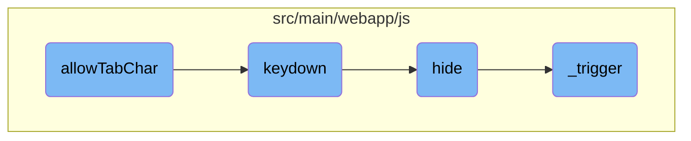

This document explains the purpose and functionality of the <SwmToken path="src/main/webapp/js/allow-tab.js" pos="17:3:3" line-data="    function allowTabChar(el) {">`allowTabChar`</SwmToken> function. It details how the function enables the use of the tab character within input fields by listening for keydown events and inserting a tab character when the tab key is pressed.

The <SwmToken path="src/main/webapp/js/allow-tab.js" pos="17:3:3" line-data="    function allowTabChar(el) {">`allowTabChar`</SwmToken> function allows users to insert tab characters in input fields, which is useful for text areas where indentation is needed. It listens for keydown events, and when the tab key is pressed, it inserts a tab character and prevents the default tab behavior. This ensures that pressing the tab key doesn't move the focus away from the input field but instead adds a tab character at the cursor's position.

# Flow drill down



<SwmSnippet path="/src/main/webapp/js/allow-tab.js" line="17">

---

## Handling Tab Character

The <SwmToken path="src/main/webapp/js/allow-tab.js" pos="17:3:3" line-data="    function allowTabChar(el) {">`allowTabChar`</SwmToken> function enables the use of the tab character within an input field. It listens for the keydown event and, if the tab key is pressed, it inserts a tab character into the input field and prevents the default tab behavior. This is particularly useful for text areas where indentation is needed.

```javascript
    function allowTabChar(el) {
        $(el).keydown(function(e) {
            if (e.which == 9) {
                pasteIntoInput(this, "\t");
                return false;
            }
        });

        // For Opera, which only allows suppression of keypress events, not keydown
        $(el).keypress(function(e) {
            if (e.which == 9) {
                return false;
            }
        });
    }
```

---

</SwmSnippet>

<SwmSnippet path="/src/main/webapp/js/lib/datepicker/datepicker.js" line="1121">

---

## Keydown Event

The <SwmToken path="src/main/webapp/js/lib/datepicker/datepicker.js" pos="1121:1:1" line-data="		keydown: function(e){">`keydown`</SwmToken> function handles various key events for the datepicker. It includes logic for navigation keys (left, right, up, down), escape key to hide the picker, enter key to select a date, and the tab key to hide the picker. This function ensures that the datepicker responds appropriately to user input via the keyboard.

```javascript
		keydown: function(e){
			if (this.picker.is(':not(:visible)')){
				if (e.keyCode === 27) // allow escape to hide and re-show picker
					this.show();
				return;
			}
			var dateChanged = false,
				dir, newDate, newViewDate,
				focusDate = this.focusDate || this.viewDate;
			switch (e.keyCode){
				case 27: // escape
					if (this.focusDate){
						this.focusDate = null;
						this.viewDate = this.dates.get(-1) || this.viewDate;
						this.fill();
					}
					else
						this.hide();
					e.preventDefault();
					break;
				case 37: // left
```

---

</SwmSnippet>

<SwmSnippet path="/src/main/webapp/js/lib/datepicker/datepicker.js" line="419">

---

## Hiding Datepicker

The <SwmToken path="src/main/webapp/js/lib/datepicker/datepicker.js" pos="419:1:1" line-data="		hide: function(){">`hide`</SwmToken> function hides the datepicker. It checks if the datepicker is visible and then hides it, detaches it from the DOM, and resets the focus date. It also triggers the 'hide' event to notify other parts of the application that the datepicker has been hidden.

```javascript
		hide: function(){
			if (this.isInline)
				return;
			if (!this.picker.is(':visible'))
				return;
			this.focusDate = null;
			this.picker.hide().detach();
			this._detachSecondaryEvents();
			this.viewMode = this.o.startView;
			this.showMode();

			if (
				this.o.forceParse &&
				(
					this.isInput && this.element.val() ||
					this.hasInput && this.element.find('input').val()
				)
			)
				this.setValue();
			this._trigger('hide');
		},
```

---

</SwmSnippet>

<SwmSnippet path="/src/main/webapp/js/lib/datepicker/datepicker.js" line="386">

---

## Triggering Events

The <SwmToken path="src/main/webapp/js/lib/datepicker/datepicker.js" pos="386:1:1" line-data="		_trigger: function(event, altdate){">`_trigger`</SwmToken> function triggers custom events related to the datepicker. It constructs an event object with the current date and other relevant information and then triggers the event on the datepicker element. This allows other parts of the application to listen for and respond to these events.

```javascript
		_trigger: function(event, altdate){
			var date = altdate || this.dates.get(-1),
				local_date = this._utc_to_local(date);

			this.element.trigger({
				type: event,
				date: local_date,
				dates: $.map(this.dates, this._utc_to_local),
				format: $.proxy(function(ix, format){
					if (arguments.length === 0){
						ix = this.dates.length - 1;
						format = this.o.format;
					}
					else if (typeof ix === 'string'){
						format = ix;
						ix = this.dates.length - 1;
					}
					format = format || this.o.format;
					var date = this.dates.get(ix);
					return DPGlobal.formatDate(date, format, this.o.language);
				}, this)
```

---

</SwmSnippet>

&nbsp;

*This is an auto-generated document by Swimm AI 🌊 and has not yet been verified by a human*

<SwmMeta version="3.0.0" repo-id="Z2l0aHViJTNBJTNBZ3JlZW5maWVsZC1lY29tbWVyY2UlM0ElM0FTd2ltbS1EZW1v" repo-name="greenfield-ecommerce" doc-type="flows"><sup>Powered by [Swimm](/)</sup></SwmMeta>
