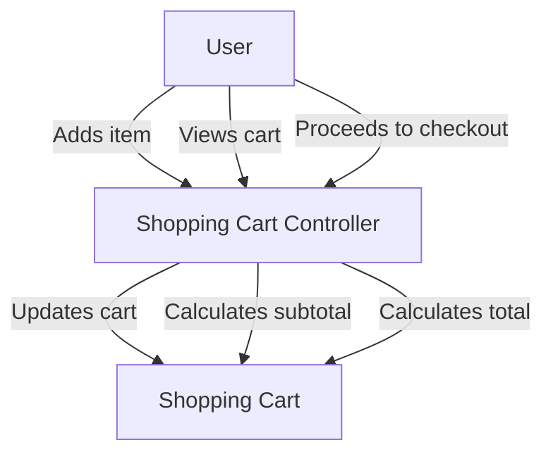

The Shopping Cart is a core component that allows users to add, view, and manage products they intend to purchase.

It supports both authenticated and anonymous users, enabling them to add items to the cart, update quantities, and remove items.

The Shopping Cart maintains various attributes such as the unique identifier (UUID), status, taxes, shipping costs, subtotal, and total amount.

It also keeps track of the associated account for authenticated users and the date when the cart was created and last updated.

The Shopping Cart Controller handles various actions like adding items, viewing the cart, and proceeding to checkout.

The controller also includes methods for calculating the subtotal, total, and shipping costs, ensuring the cart's financial details are accurate.

Views associated with the Shopping Cart provide interfaces for listing all carts, showing details of a specific cart, and previewing the checkout process.

<SwmSnippet path="/grails-app/domain/org/greenfield/ShoppingCart.groovy" line="3">

---

Shopping Cart Attributes The Shopping Cart maintains various attributes such as the unique identifier (UUID), status, taxes, shipping costs, subtotal, and total amount. It also keeps track of the associated account for authenticated users and the date when the cart was created and last updated.

```groovy
class ShoppingCart {
	
	ShoppingCart(){
		this.uuid = UUID.randomUUID().toString()
	}
	
	String uuid

	String status
	BigDecimal taxes
	BigDecimal shipping
	BigDecimal subtotal
	BigDecimal total
		
	//TODO:remove for anonymous checkout?	
	Account account
		
  	Date dateCreated
	Date lastUpdated
	
	String shipmentId
```

---

</SwmSnippet>

<SwmSnippet path="/grails-app/controllers/greenfield/ShoppingCartController.groovy" line="49">

---

Shopping Cart Controller The Shopping Cart Controller handles various actions like adding items, viewing the cart, and proceeding to checkout.

```groovy
class ShoppingCartController {

    static allowedMethods = [save: "POST", update: "POST", delete: "POST"]

```

---

</SwmSnippet>

<SwmSnippet path="/grails-app/controllers/greenfield/ShoppingCartController.groovy" line="130">

---

The <SwmToken path="grails-app/controllers/greenfield/ShoppingCartController.groovy" pos="130:3:3" line-data="	def add(){">`add`</SwmToken> method in the Shopping Cart Controller allows users to add items to the cart, ensuring the product exists and the quantity is valid.

```groovy
	def add(){
		
		def productInstance = Product.findById(params.id)
		
		if(!productInstance){
			flash.message = "Product could not be found"
			redirect(controller : 'product', action : 'details', id : params.id)
			return
		}
		
		if(!params.quantity || 
			!params.quantity.isInteger()){
			flash.message = "Quantity must be a valid number"
			redirect(controller : 'product', action : 'details', id : params.id )
			return
		}
		
		if(productInstance.quantity < Integer.parseInt(params.quantity)){
			flash.message = "We do not have enough of this product to cover your request.<br/>We currently have <strong>${productInstance.quantity}</strong> in stock."
			redirect(controller : 'product', action : 'details', id : params.id )
			return
```

---

</SwmSnippet>

<SwmSnippet path="/grails-app/controllers/greenfield/ShoppingCartController.groovy" line="304">

---

The <SwmToken path="grails-app/controllers/greenfield/ShoppingCartController.groovy" pos="304:3:3" line-data="	def remove_item(Long id){">`remove_item`</SwmToken> method in the Shopping Cart Controller allows users to remove items from the cart.

```groovy
	def remove_item(Long id){
		def shoppingCart = ShoppingCart.get(id)
		def shoppingCartItem = ShoppingCartItem.get(Long.parseLong(params.itemId))
		
		if(shoppingCart && shoppingCartItem){
			flash.message = "Successfully removed item from cart"
			shoppingCartItem.delete(flush:true)
			
			redirect(action:'index', id:id)
		}else{
			flash.message = "Item not found in cart"
			redirect(action:'index', id:id)
		}	
	}
```

---

</SwmSnippet>

<SwmSnippet path="/grails-app/controllers/greenfield/ShoppingCartController.groovy" line="737">

---

The <SwmToken path="grails-app/controllers/greenfield/ShoppingCartController.groovy" pos="737:3:3" line-data="	def calculateShoppingCartSubtotal(shoppingCart){">`calculateShoppingCartSubtotal`</SwmToken> method in the Shopping Cart Controller calculates the subtotal of the items in the cart.

```groovy
	def calculateShoppingCartSubtotal(shoppingCart){
		if(shoppingCart &&
			shoppingCart?.shoppingCartItems.size() > 0){
			shoppingCart.subtotal = calculateSubTotal(shoppingCart)
			shoppingCart.save(flush:true)
		}
	}
```

---

</SwmSnippet>

<SwmSnippet path="/grails-app/controllers/greenfield/ShoppingCartController.groovy" line="765">

---

The <SwmToken path="grails-app/controllers/greenfield/ShoppingCartController.groovy" pos="765:3:3" line-data="	def calculateTotal(shoppingCart, account){">`calculateTotal`</SwmToken> method in the Shopping Cart Controller calculates the total amount of the cart, including taxes and shipping costs.

```groovy
	def calculateTotal(shoppingCart, account){
		
		//println "calculate total..."

		if(shoppingCart &&
			shoppingCart?.shoppingCartItems.size() > 0){
			
			def subtotal = calculateSubTotal(shoppingCart)
			subtotal = applicationService.formatTotal(subtotal)
			
			calculateShipping(shoppingCart, account)
			
			def taxRate = applicationService.getTaxRate()
			def taxPercent = taxRate/100

			def taxes = 0
			taxes = subtotal * taxPercent
			taxes = applicationService.formatPrice(taxes)
		
			def total = 0 
			
```

---

</SwmSnippet>



# Shopping Cart APIs

Shopping Cart APIs

<SwmSnippet path="/grails-app/views/shoppingCart/index.gsp" line="71">

---

## <SwmToken path="grails-app/views/shoppingCart/index.gsp" pos="71:15:15" line-data="							&lt;g:form controller=&quot;shoppingCart&quot; action=&quot;remove_item&quot; method=&quot;get&quot; id=&quot;${shoppingCartInstance.id}&quot;&gt;">`remove_item`</SwmToken>

The <SwmToken path="grails-app/views/shoppingCart/index.gsp" pos="71:15:15" line-data="							&lt;g:form controller=&quot;shoppingCart&quot; action=&quot;remove_item&quot; method=&quot;get&quot; id=&quot;${shoppingCartInstance.id}&quot;&gt;">`remove_item`</SwmToken> endpoint is used to remove an item from the shopping cart. It is accessed via a form submission with the item ID and shopping cart ID as hidden inputs.

```groovy server pages
							<g:form controller="shoppingCart" action="remove_item" method="get" id="${shoppingCartInstance.id}">
								<input type="hidden" name="itemId" value="${item.id}"/>
								<input type="hidden" name="id" value="${shoppingCartInstance.id}"/>
								<input type="submit" class="btn btn-sm btn-default" name="submit" value="Remove Item"/>
							</g:form>
```

---

</SwmSnippet>

<SwmSnippet path="/grails-app/views/shoppingCart/index.gsp" line="88">

---

## <SwmToken path="grails-app/views/shoppingCart/index.gsp" pos="88:15:15" line-data="			&lt;g:form controller=&quot;shoppingCart&quot; action=&quot;checkout_preview&quot; id=&quot;${shoppingCartInstance?.id}&quot;&gt;">`checkout_preview`</SwmToken>

The <SwmToken path="grails-app/views/shoppingCart/index.gsp" pos="88:15:15" line-data="			&lt;g:form controller=&quot;shoppingCart&quot; action=&quot;checkout_preview&quot; id=&quot;${shoppingCartInstance?.id}&quot;&gt;">`checkout_preview`</SwmToken> endpoint is used to proceed to the checkout preview page. It is accessed via a form submission with the shopping cart ID as a hidden input.

```groovy server pages
			<g:form controller="shoppingCart" action="checkout_preview" id="${shoppingCartInstance?.id}">
				<input type="hidden" name="id" value="${shoppingCartInstance?.id}"/> 
				<g:submitButton name="submit"  value="Continue Checkout" class="btn btn-primary pull-right bt-lg" id="checkout-btn"/>
			</g:form>
```

---

</SwmSnippet>

&nbsp;

*This is an auto-generated document by Swimm AI 🌊 and has not yet been verified by a human*

<SwmMeta version="3.0.0" repo-id="Z2l0aHViJTNBJTNBZ3JlZW5maWVsZC1lY29tbWVyY2UlM0ElM0FTd2ltbS1EZW1v" repo-name="greenfield-ecommerce" doc-type="overview"><sup>Powered by [Swimm](/)</sup></SwmMeta>
