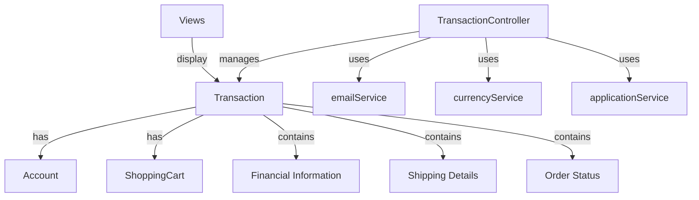

Transactions refer to the operations that handle the purchase and sale processes within the application. They encapsulate all the details related to an order, including financial information, shipping details, and the status of the order.

The <SwmToken path="grails-app/views/transaction/confirm_purchase_shipping_label.gsp" pos="31:9:9" line-data="		&lt;g:link controller=&quot;transaction&quot; ">`transaction`</SwmToken> class in the domain layer defines the structure of a transaction, including fields for total amount, subtotal, shipping costs, taxes, status, order date, and various shipping and billing details. It also includes references to the associated <SwmToken path="grails-app/controllers/greenfield/TransactionController.groovy" pos="250:9:9" line-data="		def customerToAddress = transaction?.account?.email">`account`</SwmToken> and <SwmToken path="grails-app/controllers/greenfield/TransactionController.groovy" pos="88:3:3" line-data="				def shoppingCart = transactionInstance.shoppingCart">`shoppingCart`</SwmToken>.

The <SwmToken path="grails-app/controllers/greenfield/TransactionController.groovy" pos="32:2:2" line-data="class TransactionController {">`TransactionController`</SwmToken> manages the various actions that can be performed on transactions, such as viewing transaction details, listing transactions, updating the status, deleting transactions, and handling refunds. It ensures that only authorized users, such as admins and customers, can perform these actions.

The controller methods use services like <SwmToken path="grails-app/controllers/greenfield/TransactionController.groovy" pos="37:3:3" line-data="	def emailService">`emailService`</SwmToken>, <SwmToken path="grails-app/controllers/greenfield/TransactionController.groovy" pos="38:3:3" line-data="	def currencyService">`currencyService`</SwmToken>, and <SwmToken path="grails-app/controllers/greenfield/TransactionController.groovy" pos="39:3:3" line-data="	def applicationService">`applicationService`</SwmToken> to handle specific tasks related to transactions, such as sending confirmation emails, formatting currency, and interacting with external APIs for shipping labels.

The views associated with transactions, located in the <SwmPath>[grails-app/views/transaction/](grails-app/views/transaction/)</SwmPath> directory, provide the user interface for displaying transaction details, confirming refunds, purchasing and printing shipping labels, and listing transactions.



## Transaction Structure

The <SwmToken path="grails-app/views/transaction/confirm_purchase_shipping_label.gsp" pos="31:9:9" line-data="		&lt;g:link controller=&quot;transaction&quot; ">`transaction`</SwmToken> class in the domain layer defines the structure of a transaction, including fields for total amount, subtotal, shipping costs, taxes, status, order date, and various shipping and billing details. It also includes references to the associated <SwmToken path="grails-app/controllers/greenfield/TransactionController.groovy" pos="250:9:9" line-data="		def customerToAddress = transaction?.account?.email">`account`</SwmToken> and <SwmToken path="grails-app/controllers/greenfield/TransactionController.groovy" pos="88:3:3" line-data="				def shoppingCart = transactionInstance.shoppingCart">`shoppingCart`</SwmToken>.

<SwmSnippet path="/grails-app/controllers/greenfield/TransactionController.groovy" line="31">

---

## Transaction Controller

The <SwmToken path="grails-app/controllers/greenfield/TransactionController.groovy" pos="32:2:2" line-data="class TransactionController {">`TransactionController`</SwmToken> manages the various actions that can be performed on transactions, such as viewing transaction details, listing transactions, updating the status, deleting transactions, and handling refunds.

```groovy
@Mixin(BaseController)
class TransactionController {

    static allowedMethods = [ send_confirmation: "POST", update_status: "POST", refund: 'POST', delete: "POST" ]
```

---

</SwmSnippet>

<SwmSnippet path="/grails-app/controllers/greenfield/TransactionController.groovy" line="42">

---

## Authorization

The controller ensures that only authorized users, such as admins and customers, can perform actions on transactions. For example, the <SwmToken path="grails-app/controllers/greenfield/TransactionController.groovy" pos="43:3:3" line-data="	def details(Long id){">`details`</SwmToken> method is secured to allow only users with <SwmToken path="grails-app/controllers/greenfield/TransactionController.groovy" pos="42:6:6" line-data="	@Secured([&#39;ROLE_ADMIN&#39;, &#39;ROLE_CUSTOMER&#39;])">`ROLE_ADMIN`</SwmToken> or <SwmToken path="grails-app/controllers/greenfield/TransactionController.groovy" pos="42:11:11" line-data="	@Secured([&#39;ROLE_ADMIN&#39;, &#39;ROLE_CUSTOMER&#39;])">`ROLE_CUSTOMER`</SwmToken> roles to view transaction details.

```groovy
	@Secured(['ROLE_ADMIN', 'ROLE_CUSTOMER'])
	def details(Long id){
		authenticatedPermittedOrderDetails { customerAccount, transactionInstance ->
	    	[transactionInstance: transactionInstance]
```

---

</SwmSnippet>

<SwmSnippet path="/grails-app/controllers/greenfield/TransactionController.groovy" line="37">

---

## Services

The controller methods use services like <SwmToken path="grails-app/controllers/greenfield/TransactionController.groovy" pos="37:3:3" line-data="	def emailService">`emailService`</SwmToken>, <SwmToken path="grails-app/controllers/greenfield/TransactionController.groovy" pos="38:3:3" line-data="	def currencyService">`currencyService`</SwmToken>, and <SwmToken path="grails-app/controllers/greenfield/TransactionController.groovy" pos="39:3:3" line-data="	def applicationService">`applicationService`</SwmToken> to handle specific tasks related to transactions, such as sending confirmation emails, formatting currency, and interacting with external APIs for shipping labels.

```groovy
	def emailService
	def currencyService
	def applicationService
	
```

---

</SwmSnippet>

## Views

The views associated with transactions, located in the <SwmPath>[grails-app/views/transaction/](grails-app/views/transaction/)</SwmPath> directory, provide the user interface for displaying transaction details, confirming refunds, purchasing and printing shipping labels, and listing transactions.

# Transaction APIs

Transaction APIs

<SwmSnippet path="/grails-app/views/transaction/confirm_purchase_shipping_label.gsp" line="31">

---

## <SwmToken path="grails-app/views/transaction/confirm_purchase_shipping_label.gsp" pos="32:4:4" line-data="			action=&quot;purchase_shipping_label&quot; ">`purchase_shipping_label`</SwmToken>

The <SwmToken path="grails-app/views/transaction/confirm_purchase_shipping_label.gsp" pos="32:4:4" line-data="			action=&quot;purchase_shipping_label&quot; ">`purchase_shipping_label`</SwmToken> endpoint is used to purchase a shipping label for a transaction. This action requires an active account with <SwmToken path="grails-app/controllers/greenfield/TransactionController.groovy" pos="11:4:4" line-data="import com.easypost.EasyPost">`easypost`</SwmToken> or Shippo and charges a fee per label.

```groovy server pages
		<g:link controller="transaction" 
			action="purchase_shipping_label" 
			id="${transactionInstance.id}"
			class="btn btn-primary">Purchase Label</g:link>
```

---

</SwmSnippet>

<SwmSnippet path="/grails-app/views/transaction/confirm_refund.gsp" line="23">

---

## refund

The <SwmToken path="grails-app/views/transaction/confirm_refund.gsp" pos="23:15:15" line-data="	&lt;g:form controller=&quot;transaction&quot; action=&quot;refund&quot; id=&quot;${transactionInstance.id}&quot;&gt;">`refund`</SwmToken> endpoint is used to process a refund for a transaction. It refunds the full amount to the customer's credit card, which was charged via Braintree or Stripe.

```groovy server pages
	<g:form controller="transaction" action="refund" id="${transactionInstance.id}">
```

---

</SwmSnippet>

&nbsp;

*This is an auto-generated document by Swimm AI 🌊 and has not yet been verified by a human*

<SwmMeta version="3.0.0" repo-id="Z2l0aHViJTNBJTNBZ3JlZW5maWVsZC1lY29tbWVyY2UlM0ElM0FTd2ltbS1EZW1v" repo-name="greenfield-ecommerce" doc-type="overview"><sup>Powered by [Swimm](/)</sup></SwmMeta>
