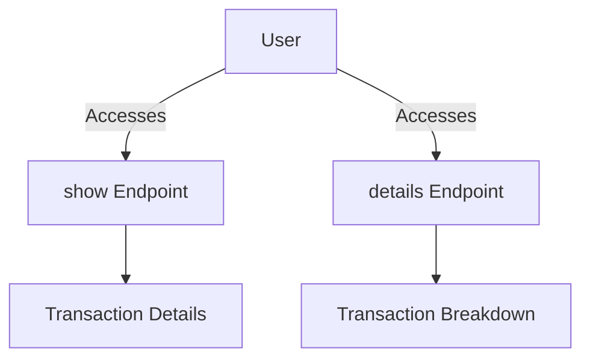

Views in Transactions are responsible for rendering the user interface related to transaction data. They provide a way to display transaction details, lists, and other related information to the user.

The <SwmPath>[grails-app/views/transaction/list.gsp](grails-app/views/transaction/list.gsp)</SwmPath> file displays a list of transactions, including details such as order number, order date, account, total, taxes, shipping, and status. It also includes pagination for navigating through multiple transactions.

The <SwmPath>[grails-app/views/transaction/details.gsp](grails-app/views/transaction/details.gsp)</SwmPath> file shows detailed information about a specific transaction, including order total, order date, order status, and a breakdown of items in the shopping cart. It also displays the shipping address associated with the transaction.

The <SwmPath>[grails-app/views/transaction/show.gsp](grails-app/views/transaction/show.gsp)</SwmPath> file provides a detailed view of a single transaction, including options to delete the transaction, view order history, update the status, and send email confirmations. It also displays billing and shipping addresses.

<SwmSnippet path="/grails-app/views/transaction/list.gsp" line="1">

---

Transaction List View The <SwmPath>[grails-app/views/transaction/list.gsp](grails-app/views/transaction/list.gsp)</SwmPath> file displays a list of transactions, including details such as order number, order date, account, total, taxes, shipping, and status. It also includes pagination for navigating through multiple transactions.

```groovy server pages

<%@ page import="org.greenfield.Transaction" %>
<%@ page import="org.greenfield.ApplicationService" %>
<% def applicationService = grailsApplication.classLoader.loadClass('org.greenfield.ApplicationService').newInstance()%>
<% def currencyService = grailsApplication.classLoader.loadClass('org.greenfield.CurrencyService').newInstance()%>

<!DOCTYPE html>
<html>
	<head>
		<meta name="layout" content="admin">
		<g:set var="entityName" value="${message(code: 'transaction.label', default: 'Transaction')}" />
		<title>Greenfield : Orders</title>
	</head>
	<body>


		<div id="list-transaction" class="content scaffold-list" role="main">
			<h2>Orders</h2>
			<g:if test="${flash.message}">
				<div class="alert alert-info" role="status">${flash.message}</div>
```

---

</SwmSnippet>

<SwmSnippet path="/grails-app/views/transaction/details.gsp" line="1">

---

Transaction Details View The <SwmPath>[grails-app/views/transaction/details.gsp](grails-app/views/transaction/details.gsp)</SwmPath> file shows detailed information about a specific transaction, including order total, order date, order status, and a breakdown of items in the shopping cart. It also displays the shipping address associated with the transaction.

```groovy server pages
<%@ page import="org.greenfield.ApplicationService" %>
<% def applicationService = grailsApplication.classLoader.loadClass('org.greenfield.ApplicationService').newInstance()%>
<% def currencyService = grailsApplication.classLoader.loadClass('org.greenfield.CurrencyService').newInstance()%>

${raw(applicationService.getDefaultHeader("Order Details"))}


	<h2>Order # : ${transactionInstance.id}
	<g:link controller="account" class="btn btn-default pull-right" action="order_history">Order History</g:link>
	</h2>
	<h5>Order Total : ${currencyService.format(applicationService.formatPrice(transactionInstance.total))}</h5>
	<h5>Order Date : <g:formatDate format="hh:mm z - dd MMM yyyy " date="${transactionInstance.orderDate}"/></h5>
	<h5>Order Status : ${transactionInstance.status}</h5>
	
	<table class="table table-condensed table-bordered">
		<thead>
			<tr style="background:#efefef">
				<th style="text-align:center;">Item #</th>
				<th>Name</th>
				<th style="text-align:center;">Price</th>
```

---

</SwmSnippet>

<SwmSnippet path="/grails-app/views/transaction/show.gsp" line="1">

---

Single Transaction View The <SwmPath>[grails-app/views/transaction/show.gsp](grails-app/views/transaction/show.gsp)</SwmPath> file provides a detailed view of a single transaction, including options to delete the transaction, view order history, update the status, and send email confirmations. It also displays billing and shipping addresses.

```groovy server pages

<%@ page import="org.greenfield.Transaction" %>
<%@ page import="org.greenfield.ApplicationService" %>
<%@ page import="org.greenfield.common.OrderStatus" %>
<% def applicationService = grailsApplication.classLoader.loadClass('org.greenfield.ApplicationService').newInstance()%>
<% def currencyService = grailsApplication.classLoader.loadClass('org.greenfield.CurrencyService').newInstance()%>

<!DOCTYPE html>
<html>
	<head>
		<meta name="layout" content="admin">
		<g:set var="entityName" value="${message(code: 'transaction.label', default: 'Transaction')}" />
		<title><g:message code="default.show.label" args="[entityName]" /></title>
	</head>
	<body>
	
	
	<g:if test="${flash.message}">
		<div class="alert alert-info" style="margin-top:20px;">${flash.message}</div>
	</g:if>
```

---

</SwmSnippet>

# Transaction Views Endpoints

Transaction Views Endpoints

<SwmSnippet path="/grails-app/views/transaction/show.gsp" line="2">

---

## show

The <SwmToken path="grails-app/views/transaction/show.gsp" pos="13:13:13" line-data="		&lt;title&gt;&lt;g:message code=&quot;default.show.label&quot; args=&quot;[entityName]&quot; /&gt;&lt;/title&gt;">`show`</SwmToken> endpoint provides a detailed view of a single transaction. It includes options to delete the transaction, view order history, update the status, and send email confirmations. It also displays billing and shipping addresses.

```groovy server pages
<%@ page import="org.greenfield.Transaction" %>
<%@ page import="org.greenfield.ApplicationService" %>
<%@ page import="org.greenfield.common.OrderStatus" %>
<% def applicationService = grailsApplication.classLoader.loadClass('org.greenfield.ApplicationService').newInstance()%>
<% def currencyService = grailsApplication.classLoader.loadClass('org.greenfield.CurrencyService').newInstance()%>

<!DOCTYPE html>
<html>
	<head>
		<meta name="layout" content="admin">
		<g:set var="entityName" value="${message(code: 'transaction.label', default: 'Transaction')}" />
		<title><g:message code="default.show.label" args="[entityName]" /></title>
	</head>
	<body>
	
	
	<g:if test="${flash.message}">
		<div class="alert alert-info" style="margin-top:20px;">${flash.message}</div>
	</g:if>
	
	
```

---

</SwmSnippet>

<SwmSnippet path="/grails-app/views/transaction/details.gsp" line="1">

---

## details

The <SwmToken path="grails-app/views/transaction/details.gsp" pos="5:11:11" line-data="${raw(applicationService.getDefaultHeader(&quot;Order Details&quot;))}">`Details`</SwmToken> endpoint shows detailed information about a specific transaction. This includes order total, order date, order status, and a breakdown of items in the shopping cart. It also displays the shipping address associated with the transaction.

```groovy server pages
<%@ page import="org.greenfield.ApplicationService" %>
<% def applicationService = grailsApplication.classLoader.loadClass('org.greenfield.ApplicationService').newInstance()%>
<% def currencyService = grailsApplication.classLoader.loadClass('org.greenfield.CurrencyService').newInstance()%>

${raw(applicationService.getDefaultHeader("Order Details"))}


	<h2>Order # : ${transactionInstance.id}
	<g:link controller="account" class="btn btn-default pull-right" action="order_history">Order History</g:link>
	</h2>
	<h5>Order Total : ${currencyService.format(applicationService.formatPrice(transactionInstance.total))}</h5>
	<h5>Order Date : <g:formatDate format="hh:mm z - dd MMM yyyy " date="${transactionInstance.orderDate}"/></h5>
	<h5>Order Status : ${transactionInstance.status}</h5>
	
	<table class="table table-condensed table-bordered">
		<thead>
			<tr style="background:#efefef">
				<th style="text-align:center;">Item #</th>
				<th>Name</th>
				<th style="text-align:center;">Price</th>
				<th style="text-align:center;">Quantity</th>
```

---

</SwmSnippet>



&nbsp;

*This is an auto-generated document by Swimm AI 🌊 and has not yet been verified by a human*

<SwmMeta version="3.0.0" repo-id="Z2l0aHViJTNBJTNBZ3JlZW5maWVsZC1lY29tbWVyY2UlM0ElM0FTd2ltbS1EZW1v" repo-name="greenfield-ecommerce" doc-type="overview"><sup>Powered by [Swimm](/)</sup></SwmMeta>
